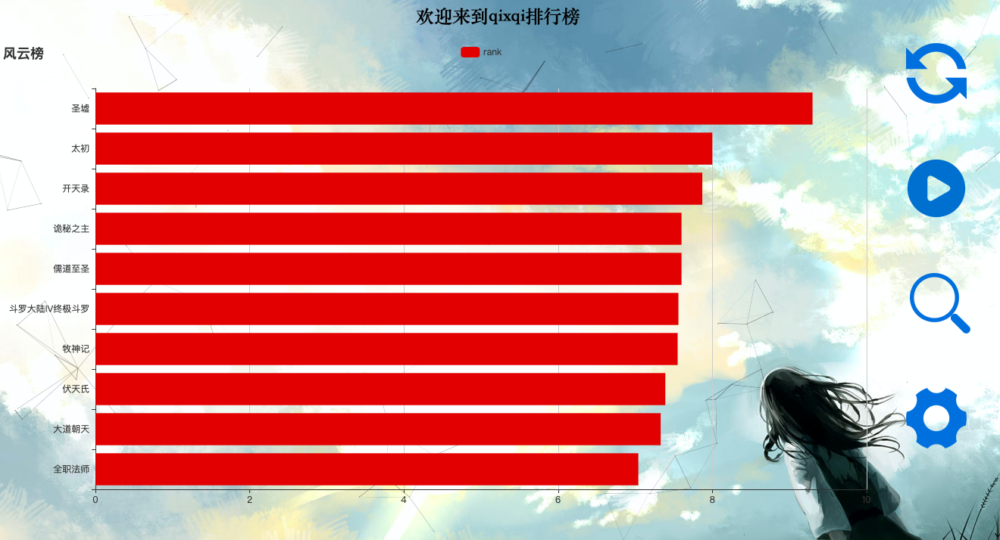

## 系统实现

[qixqiView](http://qixqi.ourvultr.club:5911)
=======

### 数据flask框架展示

* 该模块使用flask开源网络框架组织网页，同时使用jQuery，echarts等开源技术控制网页的显示，程序后台流程图如图4-2-1所示：


<center>图4-2-1</center>

* 程序前端流程图如图4-2-2所示：


<center>图4-2-2</center>


#### 4.2.1 flask框架

* 由于flask网络框架比较轻量，所以Python编写网页比较方便快捷，app.py文件也比较简洁，共有三个页面，@app.route(‘/’)配置主页面路由，@app.route(‘getBook’, methods=[‘GET’])是js文件获取爬取使用，@app.route(‘/error’)配置出错页面的路由。


* 核心代码如下：

```python
APP_ROOT = os.path.dirname(os.path.abspath(__file__))
QidianSpider_static_path = os.path.join(APP_ROOT, '../../QidianSpider')     # 爬去到的json文件信息目录


@app.route('/')
def index():
    return render_template('index.html')


@app.route('/getBook', methods=['GET'])
def getBook():
    # print('-'*100)
    # print(QidianSpider_static_path)
    # print(type(QidianSpider_static_path))
    # print('-'*100)
    rst = make_response('{}')
    with open(os.path.join(QidianSpider_static_path, 'ebook.json'), 'r') as fp:
        dataDict = json.load(fp)
        dataStr = json.dumps(dataDict, ensure_ascii=False)
        print(dataStr)
        # return dataStr
        rst = make_response(dataStr)
    rst.headers['Access-Control-Allow-Origin'] = '*'
    return rst
    


@app.route('/error')
def error():
    return render_template('error.html')
```


* 同时，利用Jinja2模版功能，配置网络路由是返回html格式的模版，比如@app.route(‘/’)的模版
* 网页主页面效果图如图4-2-3所示：


<center>图4-2-3</center>


* 核心代码如下：

```html
<head>
        <title>qixqi排行榜</title>
        <link type="text/css" rel="stylesheet" href="{{ url_for('static', _external=True, filename='css/index.css') }}" />
    </head>
    <body>
        <h2>欢迎来到qixqi排行榜</h2>

        <div id="rank"></div>

        <div id="process">
            <br />
            <br />
            <br />
            
        </div>

        <div id="setting">
            <label for="period" class="setting_content">刷新时长(秒)：</label><br />
            <!-- step=0.1 支持一位小数-->
            <input type="number" id="period" min="0.1" max="60" step="0.1" class="setting_input" name="period" placeholder="刷新时长(秒)" tabindex="1" /><br />
            <label for="maxItemNum" class="setting_content">展示最大条数：</label><br />
            <!-- step=1 只支持整数 -->
            <input type="number" id="maxItemNum" step="1" class="setting_input" name="maxItemNum" placeholder="展示最大条数" tabindex="2" /><br />
            <div id="choice">
                <!-- 设置label的focus方法后，便不应该在设置label的for属性 -->
                <input type="radio" name="choice" class="choice choice_left" value="default" id="default" checked="checked" />
                <label class="choice" tabindex="3">default</label>
                <input type="radio" name="choice" class="choice choice_right" value="rating" id="rating" />
                <label class="choice" tabindex="4">rating</label><br />
                <input type="radio" name="choice" class="choice choice_left" value="user_count" id="user_count" />
                <label class="choice" tabindex="5">user_count</label>
                <input type="radio" name="choice" class="choice choice_right" value="week_recommend" id="week_recommend" />
                <label class="choice" tabindex="6">recommend</label><br />
            </div>
            <input type="button" name="cancel" value="取消" id="cancel" class="setting_button" tabindex="3" />
            <input type="button" name="confirm" value="确定" id="confirm" class="setting_button" tabindex="4" />
        </div>

        <div id="search">
            <label for="search_content" class="setting_content">搜索内容</label><br />
            <input type="text" name="search" id="search_content" class="search_input" placeholder="search" tabindex="1" /><br />
            <input type="button" name="cancel" value="取消" id="search_cancel" class="search_button" tabindex="2" />
            <input type="button" name="confirm" value="搜索" id="search_confirm" class="search_button" tabindex="3" />
        </div>

        <script type="text/javascript" src="{{ url_for('static', _external=True, filename='js/jquery-3.4.1.min.js') }}"></script>
        <script type="text/javascript" src="{{ url_for('static', _external=True, filename='js/echarts.js') }}"></script>
        <script type="text/javascript" src="{{ url_for('static', _external=True, filename='js/canvas-nest.min.js') }}"></script>
        <script type="text/javascript" src="{{ url_for('static', _external=True, filename='js/index.js') }}"></script>
</body>
```


#### jQuery和echarts控制页面显示和事件处理

* 由于页面中各个事件的处理以及css样式的控制，这部分比起flask框架比较复杂，首先页面加载完毕后，ajax访问后台http://127.0.0.1:5000/getBook获取爬到的数据

  

* 核心代码如下：

```javas
$.ajax({        // 跨域访问
        type: 'get',    // 不支持post跨域访问
        async: false,
        url: 'http://localhost:5000/getBook',
        dataType: 'json',
        success: function(data){
            data.sort($.sortRule());    // 排序
            names = data.map(item => item.name);    // 获取属性数组
            ranks = data.map(item => $.rank(item.rating, item.user_count, item.week_recommend));
            $.initView(names.slice(0, maxItemNum), ranks.slice(0, maxItemNum));
            counter = 0;
            length = names.length;
            console.log(length);

				  // 此处成功后的事件处理代码
             ...
        },
        error: function(err){
            window.location.href = '/error';
            console.error(err.responseText);
        }
});
```

* ajax访问数据由两部分构成，成功时调用success函数，出现异常时调用error函数重定向到http://127.0.0.1:5000/error页面，使用templates/error.html模版显示网页

  

* 效果如图4-2-4所示：


<center>图4-2-4</center>

* Ajax 获取获取数据成功后首先将数据进行排序，由于爬取到的数据中与排序有关的数据有rating, user_count, week_recommend，所以需要自定义排序策略将三种数据结合起来综合排名，这里规定总分值10分，rating占比5分，user_count占比2.5分，week_recommend占比2.5分，所以由于rating原来是10分值，只需要折半即可，而user_count和week_recommend则是不同的范围映射到不同的分值

  

* 核心代码如下：

```javascript
   jQuery.extend({
        'rank': function(rating, user_count, week_recommend){
            var result = rating;
            if(user_count < 2000){
                result += user_count/500 + 1;
            }else{
                result += 5;
            }
            if(week_recommend < 4){
                result += parseInt(week_recommend) + 1;
            }else{
                result += 5;
            }
            return (result / 2).toFixed(2);     // 保留两位小数
        }
    });


    // 利用jquery中sort()的自定义方法
    jQuery.extend({
        'sortRule': function(){
            return function(book1, book2){
                rank1 = $.rank(book1.rating, book1.user_count, book1.week_recommend);
                rank2 = $.rank(book2.rating, book2.user_count, book2.week_recommend);
                if(rank1 < rank2){        // 因为靠前的在下面，所以rank小
                    return 1;       // 交换位置
                }else if(rank1 > rank2){
                    return -1;      // 不要交换位置
                }else{
                    return 0;       // 不要交换位置
                }
            };
        }
		});
```

* 数据排序后，echarts利用得到的数据初始化视图

  

* 如图4-2-5所示：


<center>4-2-5</center>

* 核心代码如下：

```javascript
// 初始化表
    jQuery.extend({
        'initView': function(names, ranks){
            console.log(names);
            console.log(ranks);
            /* 柱状图 */
            // var rankBar = echarts.init(document.getElementById('rank'));
            // rankBar.showLoading();      // 打开loading动画
            rankBar.hideLoading();      // 隐藏loading动画
            rankBar.setOption({
                title:{
                    text: '风云榜'
                },
                tooltip: {},
                legend: {
                    data: ['rank']
                },
                xAxis:{},
                yAxis: {
                    data: names.reverse()       // 数组倒置
                },
                series: [{
                    name: 'rank',
                    type: 'bar',
                    smooth: true,   // 数据光滑过度
                    itemStyle: {
                        normal: {
                            color: '#d11b1a'
                        }
                    },
                    data: ranks.reverse()
                }]
            });
            // return rankBar;
        }
});
```


#####  4.2.2.1 动态展示模块

* 如果爬取的数据比较多的话，很难在一张网页中展示，所以要进行分页处理，这时可以动态加载页面，比如每隔1s向上刷新1条数据，时间间隔和每页展示最大条目个数可以在浏览器中自定义。
* 点击图4-2-6中开始按钮：


<center>图4-2-6</center>

* 图表便开始动态加载数据，由于不能保存动态图，这里使用4s后的图表展示，图表信息向上刷新了4条
* 如图4-2-7所示：


<center>图4-2-7</center>

* 可以随时点击暂停按钮定制动态展示

* 该模块的核心代码如下：

```javascript
    // 刷新表
    jQuery.extend({
        'flushView': function(names, ranks){
            rankBar.setOption({
                yAxis: {
                    data: names.reverse()       // 数组倒置
                },
                series: [{
                    name: 'rank',
                    type: 'bar',
                    smooth: true,
                    itemStyle: {
                        normal: {
                            color: '#d11b1a'
                        }  
                    },
                    data: ranks.reverse()       // 数组倒置
                }]
            }); 
        }
});


            // 开始/播放按钮点击事件
            $('.run').click(function(){
                if(flushTimeout == null){           // pause --> start
                    // alert('pause');
                    flushTimeout = setInterval(function(){
                        if(length - counter >= maxItemNum && counter > 0){
                            $.flushView(names.slice(counter, counter + maxItemNum), ranks.slice(counter, counter+maxItemNum));
                        }
                        counter ++;
                        if(length - counter < maxItemNum){
                            console.log(counter);
                            clearInterval(flushTimeout);
                            flushTimeout = null;
                            $('.run').attr({'src': './static/img/start.png', 'title': '开始', 'alt': '开始'});
                        }
                    }, period * 1000);
                    console.log(flushTimeout);
                    $('.run').attr({'src':'./static/img/pause.png', 'title': '暂停', 'alt': '暂停'});
                }else{                              // start --> pause
                    // alert('start');
                    clearInterval(flushTimeout);
                    console.log('flushTimeout: ' + flushTimeout);
                    flushTimeout = null;
                    console.log('flushTimeout: ' + flushTimeout);
                    $('.run').attr({'src': './static/img/start.png', 'title': '开始', 'alt': '开始'});
                }
            });
```


##### 4.2.2.2 搜索模块

* 由于分页显示，为了便于查找某一条目信息，所以加入搜索功能，定位到该条目信息。

* 首先点击图4-2-8中的搜索图像按钮：


<center>图4-2-8</center>

* 然后网页背景会虚化，显示搜索框，输入搜索内容，这里输入“全职法师”
* 如图4-2-9：


<center>图4-2-9</center>

* 点击搜索按钮或者按下“Enter”键，图表便定位到“全职法师”条目
* 如图4-2-10所示：


<center>图4-2-10</center>

* 搜索到的条目有青绿色着重显示

* 该模块的核心代码如下：

```javascript
// 搜索效果刷新
    jQuery.extend({
        'searchFlushView': function(names, ranks, index){
            rankBar.setOption({
                yAxis: {
                    data: names.reverse()
                },
                series: [{
                    name: 'rank',
                    type: 'bar',
                    smooth: true,
                    itemStyle:{
                        normal:{
                            color: function(params){
                                if(params.dataIndex == index){
                                    return '#00FF00';       // 选中颜色，绿色
                                }else{
                                    return '#d11b1a';
                                }
                            }
                        }
                    },
                    data: ranks.reverse()
                }]
            });
        }
    });


    // 简单搜索功能
    jQuery.extend({
        'simpleSearch': function(names, content){
            result = -1;
            $.each(names, function(index, value){       // 遍历数组
                // console.log('i = ' + index + ', content = ' + content + ', value = ' + value);
                if(content == value){
                    // console.log('叮咚');
                    result = index;
                    return false;       // 终止循环
                }
            });
            return result;
        }
});


 // 搜索图片点击事件
            $('.search').click(function(){
                // alert('搜索');
                // $('div:visible').css('opacity', '0.1');
                $('#rank').css('opacity', '0.1');
                $('#process').css('opacity', '0.1');
                $('h2').css('opacity', '0.1');
                if($('#setting').css('visibility') == 'visible'){
                    $('#setting').css('visibility', 'hidden');
                }
                // $('.setting').off('click');     // setting点击方法禁用
                // $('.setting').attr('disabled', 'disabled');
                $('#search').css('visibility', 'visible');
                $('#search_content').focus();
                $.enterKeyDown('search');
            });


            // 搜索取消按钮点击事件
            $('#search_cancel').click(function(){
                $('#rank').css('opacity', '1.0');
                $('#process').css('opacity', '1.0');
                $('h2').css('opacity', '1.0');
                $('#search').css('visibility', 'hidden');
                $.enterKeyDown(null);       // 解除键绑定
                // $('.setting').on('click');
                // $('.setting').attr('disabled', false);
                // $('div:hidden').css('opacity', '1.0');
            });


            // 搜索确定按钮点击事件
            $('#search_confirm').click(function(){
                // alert('搜索');
                content = $('#search_content').val().trim();
                if(content == ''){
                    alert('empty');
                }else{
                    index = $.simpleSearch(names, content);
                    // alert(index);
                    if(index == -1){
                        alert('未找到该条目');
                    }else if(index + maxItemNum <= length){
                        counter = index;
                        $.searchFlushView(names.slice(counter, counter+maxItemNum), ranks.slice(counter, counter+maxItemNum), maxItemNum-1);       // 数组倒置了
                    }else{
                        counter = maxItemNum > length ? 0 : (length - maxItemNum);
                        $.searchFlushView(names.slice(counter, length), ranks.slice(counter, length), length-index-1);      // 数组倒置了
                    }
                }
                $('#rank').css('opacity', '1.0');
                $('#process').css('opacity', '1.0');
                $('h2').css('opacity', '1.0');
                $('#search').css('visibility', 'hidden');
                $.enterKeyDown(null);       // 解除键绑定
            });
```


##### 4.2.2.3 设置模块

* 在设置模块中，可以设置动态刷新时的时间间隔和每页展示条目个数，同时还可以设置图表类型，有默认排名推荐柱状图、rating总览折线图、user_count总览折线图、week_recommend总览折线图。

* 首先，点击图4-2-11中的设置图片按钮


<center>图4-2-11</center>

* 同样背景虚化，然后设置框出现，如图4-2-12:


<center>图4-2-12</center>

* 在这里设置刷新时长和展示最大条数，可以在动态展示模块立即显示效果，这里就不再赘述。

* 设置图表类型为rating，效果如图4-2-13所示：


<center>图4-2-13</center>

* 设置图表类型为user_count，效果如图4-2-14所示：


<center>图4-2-14</center>

* 设置图表类型为week_recommend，效果如图4-2-15所示：


<center>图4-2-15</center>

* 设置模块核心代码如下：

```javascript
// 小说rating总揽
    jQuery.extend({
        'modifyView': function(names, numbers, title, name){
            // console.log('names = ' + names);
            // console.log('numbers = ' + numbers);
            rankBar.clear();
            clearFlag = true;
            viewType = name;
            if(flushTimeout != null){
                clearInterval(flushTimeout);
                flushTimeout = null;
                $('.run').attr({'src': './static/img/start.png', 'title': '开始', 'alt': '开始'});
            }
            rankBar.setOption({
                title: {
                    text: title
                },
                tooltip: {},
                legend: {
                    data: [name]
                },
                xAxis: {
                    data: names
                },
                yAxis: {},
                series: [{
                    name: name,
                    type: 'line',
                    smooth: true,
                    data: numbers
                }]
            });
        }
    });


// 设置图片点击事件
            $('.setting:first').click(function(){
                // alert('设置选项');
                // $('body').css('opacity', '0.1');    // 设置主题背景透明度，子元素也会被设置，不灵活
                $('#rank').css('opacity', '0.1');
                $('#process').css('opacity', '0.1');
                $('h2').css('opacity', '0.1');
                if($('#search').css('visibility') == 'visible'){
                    $('#search').css('visibility', 'hidden');
                }
                $('#setting').css('visibility', 'visible');     // 设置选项可见
                $('#period').focus();       // 输入框获取焦点     
                $('#period').val(period);
                $('#maxItemNum').val(maxItemNum);
                $.enterKeyDown('setting');
            });
            // 取消按钮点击事件
            $('#cancel').click(function(){
                // alert('取消');
                $('#rank').css('opacity', '1.0');
                $('#process').css('opacity', '1.0');
                $('h2').css('opacity', '1.0');
                $('#setting').css('visibility', 'hidden');     // 设置选项隐藏
                $.enterKeyDown(null);       // 解除键绑定
            });


            // 确定按钮点击事件，不能放到图片点击事件中，否则重复绑定事件
            $('#confirm').click(function(){
                // 获取单选按钮的值
                // choice = $('input[type="radio"].choice').length;
                choice = $('input:radio:checked.choice').val();
                // alert(choice);
                if(choice != 'default'){
                    real_names = data.map(item => item.name);
                    if(choice == 'rating'){
                        ratings = data.map(item => item.rating);
                        // console.log('real_names = ' + real_names);
                        // console.log('ratings = ' + ratings);
                        $.modifyView(real_names, ratings, '评分榜', 'rating');
                    }else if(choice == 'user_count'){
                        user_counts = data.map(item => item.user_count);
                        $.modifyView(real_names, user_counts, '用户点击榜', 'user_count');
                    }else if(choice == 'week_recommend'){
                        week_recommends = data.map(item => item.week_recommend);
                        $.modifyView(real_names, week_recommends, '周推荐榜', 'week_recommend');
                    }
                    $('#rank').css('opacity', '1.0');
                    $('#process').css('opacity', '1.0');
                    $('h2').css('opacity', '1.0');
                    $('#setting').css('visibility', 'hidden');     // 设置选项隐藏
                    $.enterKeyDown(null);       // 解除键绑定

                    // img标签没有disabled属性，可以CSS中的pointer-events: none代替
                    // $('.control:first-child').attr('disabled', true);
                    // $('.run').attr('disabled', true);
                    // $('.search').attr('disabled', true);
                    // $('.control:first-child').css({'pointer-events': 'none'});
                    $('.run').css({'pointer-events': 'none'});
                    $('.search').css({'pointer-events': 'none'});
                    return;
                }

                if(clearFlag){      // echarts重建过
                    rankBar.clear();
                    end = (maxItemNum > length) ? length : counter + maxItemNum;
                    $.initView(names.slice(counter, end), ranks.slice(counter, end));
                    clearFlag = false;
                    viewType = 'default';
                    // $('.control:first-child').attr('disabled', false);
                    // $('.run').attr('diabled', false);
                    // $('.search').attr('disabled', false);
                    // $('.control:first-child').css({'pointer-events': 'auto'});
                    $('.run').css({'pointer-events': 'auto'});
                    $('.search').css({'pointer-events': 'auto'});
                }


                // alert('确定');
                // alert('this: ' + $(this).attr('id'));
                console.log('counter: ' + counter);
                console.log('length: ' + length);
                pFlag = false;  // 判断period是否改变
                mFlag = false;
                if($('#period').val().trim() != ''){
                    // alert($('#period').val());
                    temp = parseFloat($('#period').val().trim());
                    if(temp != period){
                        pFlag = true;       // period 改变
                        period = temp;
                    }
                    // alert(period);
                }
                if($('#maxItemNum').val().trim() != ''){
                    temp = parseInt($('#maxItemNum').val().trim());
                    if(temp != maxItemNum){
                        mFlag = true;       // maxItemNum 改变
                        maxItemNum = temp;
                    }
                }
                console.log('period ' + period);
                console.log('maxItemNum ' + maxItemNum);
                $('#rank').css('opacity', '1.0');
                $('#process').css('opacity', '1.0');
                $('h2').css('opacity', '1.0');
                $('#setting').css('visibility', 'hidden');     // 设置选项隐藏
                $.enterKeyDown(null);       // 解除键绑定

                // alert(flushTimeout);
                if(flushTimeout == null){       // 定时器已经关闭
                    if(mFlag){      // maxItemNum 改变
                        if(length - counter < maxItemNum){      // 回退，本来应该length - counter < maxItemNum - 1排除maxItemNum未改变情况，但由于mFlag为true，所以maxItemNum一定改变
                            counter = maxItemNum > length ? 0 : (length - maxItemNum);
                            $.flushView(names.slice(counter, length), ranks.slice(counter, length));
                        }else if(length - counter >= maxItemNum){       // 继续刷新
                            flushTimeout = setInterval(function(){
                                if(length - counter >= maxItemNum && counter > 0){
                                    $.flushView(names.slice(counter, counter + maxItemNum), ranks.slice(counter, counter + maxItemNum));
                                }
                                counter ++;
                                if(length - counter < maxItemNum){
                                    clearInterval(flushTimeout);
                                    flushTimeout = null;
                                    $('.run').attr({'src': './static/img/start.png', 'title': '开始', 'alt': '开始'});
                                }
                            }, period * 1000);
                        }
                    }
                }else{      // 定时器仍然开启
                    if(pFlag){      // period改变
                        clearInterval(flushTimeout);
                        flushTimeout = null;
                        flushTimeout = setInterval(function(){
                            if(length - counter >= maxItemNum && counter > 0){
                                $.flushView(names.slice(counter, counter + maxItemNum), ranks.slice(counter, counter + maxItemNum));
                            }
                            counter ++;
                            if(length - counter < maxItemNum){
                                clearInterval(flushTimeout);
                                flushTimeout = null;
                                $('.run').attr({'src': './static/img/start.png', 'title': '开始', 'alt': '开始'});
                            }
                        }, period * 1000);
                    }
                }
            });

            // 单选按钮选中事件
            var inputDisabledFlag = false;      // 记录是否是disabled
            $('input:radio[name="choice"]').click(function(){
                choice = $('input:radio:checked.choice').val();
                if(choice != 'default' && !inputDisabledFlag){
                    $('#period').attr('disabled', true);
                    $('#maxItemNum').attr('disabled', true);
                    $('#period').val(period);
                    $('#maxItemNum').val(maxItemNum);
                    inputDisabledFlag = true;
                }
                
                if(choice == 'default' && inputDisabledFlag){
                    $('#period').attr('disabled', false);
                    $('#maxItemNum').attr('disabled', false);
                    inputDisabledFlag = false;
                }
            });
```


##### 4.2.2.4 刷新模块

* 刷新模块可以在动态展示的过程中，在不刷新页面的前提下重新渲染图表，同时在rating、user_count、week_recommend总览图中可以重新加载动画。

* 首先，点击4-2-16中的刷新图像按钮：


<center>图4-2-16</center>

* 效果如图4-2-17所示：



<center>图4-2-17</center>

* 这里对总览图的刷新就不再展示了。

* 刷新模块的核心代码如下：

```javascript
// 刷新图片点击事件
            $('.control:first').click(function(){
                if(viewType != 'default'){      // 总览视图
                    // alert(viewType);
                    // rankBar.refresh();
                    option1 = rankBar.getOption();      // 重新加载动画
                    rankBar.clear();
                    rankBar.setOption(option1);
                    return;
                }

                // alert('点击了');
                // console.log(flushTimeout);
                if(flushTimeout != null){
                    clearInterval(flushTimeout);
                    flushTimeout = null;
                    $('.run').attr({'src': './static/img/start.png', 'title': '开始', 'alt': '开始'});
                }
                counter = 0;
                $.initView(names.slice(0, maxItemNum), ranks.slice(0, maxItemNum));
            });
```


## 系统测试

| 测试序号 | 用例                                                         | 状态 |
| -------- | ------------------------------------------------------------ | ---- |
| 1        | 运行spider.py，爬取数据                                      | 通过 |
| 2        | 获取反爬虫数据week_recommmend                                | 通过 |
| 3        | 运行flask框架主程序app.py                                    | 通过 |
| 4        | 访问http://127.0.0.1:5000                                    | 通过 |
| 5        | 访问http://127.0.0.1:5000/getBook                            | 通过 |
| 6        | 访问http://127.0.0.1:5000/error                              | 通过 |
| 7        | 点击start图像，动态展示数据                                  | 通过 |
| 8        | 动态展示数据时，点击pause图像，暂停                          | 通过 |
| 9        | 点击search图像，搜索“全职法师”条目                           | 通过 |
| 10       | 点击setting图像，设置period刷新时长                          | 通过 |
| 11       | 点击setting图像，设置页面展示条数                            | 通过 |
| 12       | 点击setting图像，单选按钮选择“rating”，显示rating总览折线图  | 通过 |
| 13       | 点击setting图像，单选按钮选择“user_count”，显示user_count总览折线图 | 通过 |
| 14       | 点击setting图像，单选按钮选择“ recommend”，显示week_recommend总览折线图 | 通过 |
| 15       | 点击setting图像，单选按钮选择“default”，显示排名柱状图       | 通过 |
| 16       | 排名柱状图下，点击refresh图像，刷新数据                      | 通过 |
| 17       | rating总览图下，点击refresh图像，刷新动画                    | 通过 |
| 18       | user_count总览图下，点击refresh图像，刷新动画                | 通过 |
| 19       | week_recommend总览图下，点击refresh图像，刷新动画            | 通过 |
| 20       | 搜索框或设置框显现时，按下Enter键，调用“确定”按钮的点击事件  | 通过 |
| 21       | 设置框显现时，点击Tag键，调用单选按钮focus事件，可以选中单选按钮 | 通过 |


## 系统总结

* 该项目共分为两个大的模块：数据爬取部分和数据flask框架网页展示部分。

  
  * ​			数据flask框架展示部分：主要使用到了flask、jQuery、echarts、css技术来将数据合理美观的展示在网页中，实现了项目需求分析的要求，该部分的flask框架并不难掌握，重点是使用模版来响应html格式的网页信息；对于jQuery(js)部分，比较复杂，需要ajax获取爬取到的信息以及对数据进行动态处理，还要处理页面中图像、单选按钮的点击事件以及focus事件，同时在jQuery部分还有修改html的css样式，使得页面流畅美观；这里选择echarts开源工具将数据渲染到网页中，并通过设置不同的option来设置不同效果的图表，进而可以通过柱状图详细动态的展示数据，也可以通过总览图显示所有数据的整体状况。数据展示部分除主模块外，还有四个小模块，分别是：刷新视图模块、动态展示模块、搜索模块、设置模块，将不同的功能和视图进行绑定，减弱不同模块之间的耦合性，便于调试和使用。刷新视图模块功能相对简单，就是在动态展示完毕后或正在动态展示时，想要初始化视图，这时就不要刷新页面，通过refresh图像的点击事件实现即可，同时，刷新视图模块，在总览折线图中可以重新加载数据。动态展示模块，包含两个状态：start 和 pause，可以通过点击start和pause图像来切换状态，这里，可以使用设置模块自定义的刷新时长和每页显示最大条数来动态展示数据，直到数据展示完成后停止。搜索模块，这里可以通过输入的书名查取响应的条目信息，并且定位到该条目，实现查找功能。设置模块，除了可以设置刷新时长和每页展示最大条数，还可以通过单选按钮切换图表视图，用来在排名柱状图、rating总览图、user_count总览图、week_recommend总览图之间切换。不足之处，排名策略上可以优化，在该项目中使用数据的分布特点划分了各个分值段的映射关系，但是，根据统计学和概率学的知识采用更加高效的分布函数会将数据拟合的更好，这样排名更具有代表性，这里是需要不断迭代优化的地方。


## 个人感悟

* ​			郑翔：这次开源课程的学习，让自己受益匪浅，学习的内容非常广泛，让自己不得不感叹Python庞大的库，由Python的简单语法开始，自己刚开始是和Java对比来学习Python的语法的，发现它们在很多方面都不一样，所以最后把它当作一门全新的语言来学习总结，讲到列表、字典、元祖的时候，是自己第一次感觉到困难，那些各自的性质和函数让我大脑一片混乱，不过，通过课下多次练习后，慢慢掌握了它们。除了Python语法外，我们还学习了开源协议、turtle库、bs4库、pandas库、表格文件读写、sqlite3和monodb数据库读写、git等等。其中对我影响最大的是git控制项目版本。在这次大作业的完成过程中，自己在每次完成一个模块，便用git提交到gitlab仓库，项目结束的时候查看提交历史，发现项目编写的过程和思路一目了然，这为自己梳理项目提供了非常优秀的工具。同时，在项目的编写过程中，自己用到了大量的开源类和工具，比如jQuery, echarts, flask等，这就极大的简化了我们的工作，优化了我们的项目，所以不得不为开源的价值观念点赞。自己负责的是数据展示部分，包含后台和前端实现，由于flask框架的简洁，使得在一个app.py文件中就完成了后台主体的编写，这点是Java和PHP难以实现的，然后，就是数据具体展示到页面上，我在主模块的基础上添加了四个小模块，分别是刷新模块、动态展示模块、搜索模块、设置模块，这样功能上有了一定的补充，使用起来也比较方便流畅，自己感觉动态展示模块比较优秀，在初始化视图的基础上，设定一定的时间间隔来动态刷新图表，达成动态分页的效果，对于结果自己还是比较满意的。由于队友爬取到的数据中包含rating、user_count、week_recommend三种衡量排名的指标，所以需要自定义排名策略，共同使用这些指标，在该项目中根据数据的分布设置了各分段分值，但是自己感觉这部分应该需要统计和概率的知识来构建一个效果更好的推荐模型，这部分是自己需要不断改进的。

  ​			当然，这次大作业的编写过程中，也遇到了很多bug，页面不能展示自己想要的结果而懊恼，但当拨云散雾的那一刻，内心由衷的喜悦！